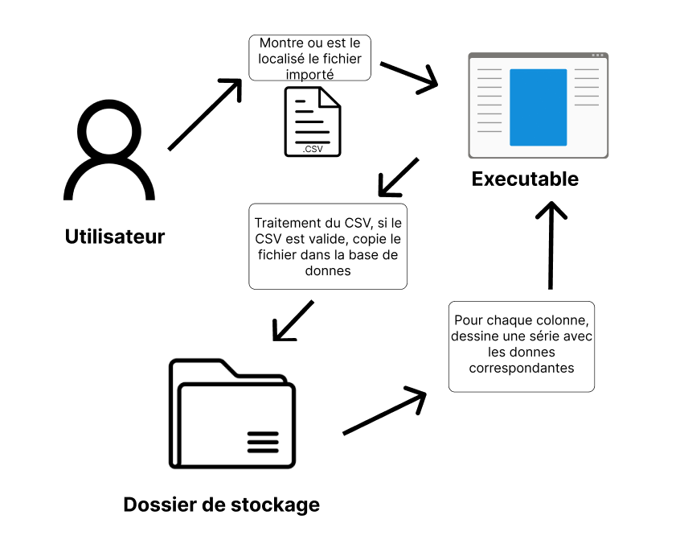

# Rapport *Plot those dots*

**Eleve:** Romain Denis

**Client:** Xavier Carrel

**Dates:** 29.08.2025 - 09.01.2026

## Introduction

### Objectifs du produit et pédagogiques
- Concevoir un logiciel pour afficher des graphiques sur des données

### Description du domaine
- P_Fun: Plot Those Lines
- J'ai décidé de me baser sur les donnés de la NBA
- Mes donnés sont venus de [BasketballReference](https://www.basketball-reference.com/) et ChatGPT
- Mes donnés sont dans */doc/data.csv*

- Limites et périmètre du projet

---

## Planification
- [GitHub Project](https://github.com/users/romaindenis1/projects/5)
- [Issues GitHub] (https://github.com/romaindenis1/plot-those-lines/issues?q=is%3Aissue)
- Les étapes clés du projet
    - Planification
    - Réalisation
    - Rapport
- Organisation du travail (planning, deadlines)

---

## Rapport de tests
- Méthodologie de test adoptée
- Résultats obtenus
- Problèmes rencontrés et corrections apportées

---

## Details technique

### Stockage

---

## Journal de travail

- Le journal de travail a été fait sur GitJournal

--- 

## Usage de l’IA dans le projet

- L'AI a seulement été utilisé pour les taches avec aucune valeure ajouté par humain, par example:
    - Le squelette de rapport
    - Donnés
- L'AI a acceleré les taches avec aucune valeur ajouté humain, et la lecture de la documentation (surtout la documentation scottplot qui est compliqué)
- Réflexion critique sur les avantages et limites

---

## Conclusion / Bilan
- Points forts du projet
- Axes d’amélioration possibles
- Compétences acquises
- Perspectives futures

---

