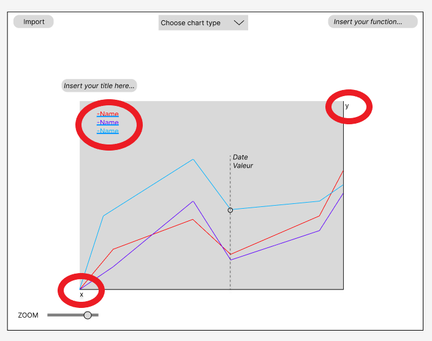
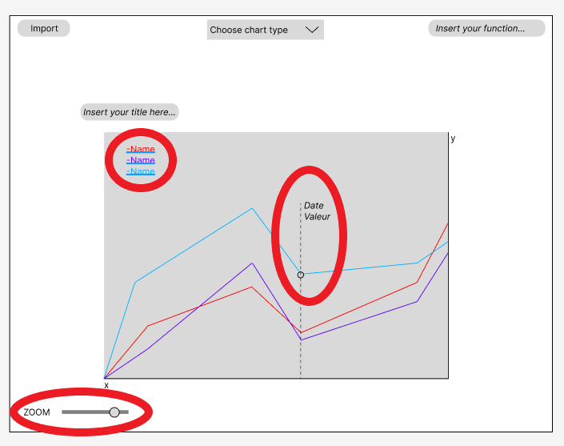
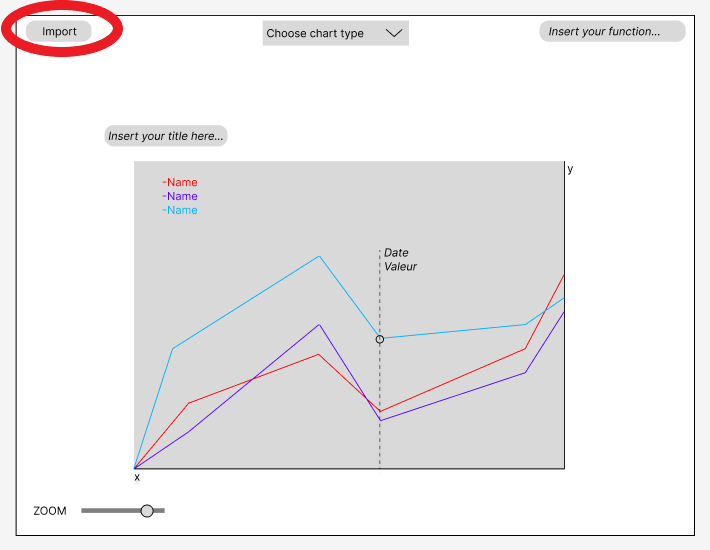
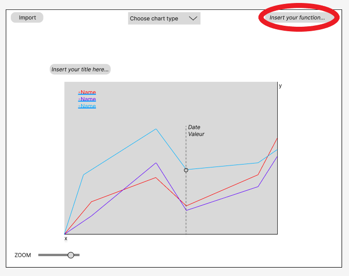

# Rapport — Plot Those Lines

**Élève :** Romain Denis  
**Client :** Xavier Carrel  
**Période :** 29.08.2025 — 09.01.2026

## Description du domaine

Application C# permettant d'importer et d'afficher des séries temporelles. L'utilisateur peut ajouter de nouveaux fichiers CSV sans perdre les données déjà chargées.

Cas d'usage principal : visualiser le nombre de victoires par équipe (ex. NBA) au fil des années. Le format attendu du CSV est : YEAR, TEAM1, TEAM2, ... ; chaque cellule représente le nombre de victoires pour l'équipe et l'année indiquées (ex. : 2025, 52, 48, ...). Si le format n'est pas respecté, l'application affiche un message d'erreur et refuse l'import.

L'interface permet de naviguer dans le temps et d'ajuster le zoom pour explorer les courbes.

## Objectifs pédagogiques

- Mettre en pratique C# (List, Dictionary, tableaux), LINQ et bonnes pratiques.  
- Organiser un projet : user stories, planification, gestion Git et tests d'acceptance.  
- Traiter des données : parsing, gestion des NaN et comparaisons flottantes (tolérances).

Ces objectifs seront travaillés via ce projet (import/export, parsing) et des livrables (code, rapport).

## Objectifs produit

Ce projet vise à fournir une interface simple pour analyser des séries de donnés. L'accent est mis sur la facilité d'importation, la comparaison visuelle et des interactions intuitives (survol, masquage, zoom).

Comparer plusieurs courbes, tracer des fonctions, afficher légendes et couleurs.  
Interactions clés :
- Import CSV
- Protection doublons
- Fusion / Remplacement
- Tracé séries
- Hover interactif
- Toggle séries
- Zoom fluide
- Sauvegarde & chargement
- Gestion Mauvaises donnés
- Extensibilité

## Domaine d’application

Le thème que j’ai choisi les vicioires des equipes NBA au fil du temps

Le but derrière est de pouvoir visualiser comment certaines equipes ont dominer leurs epoques et pour observer les evenements (lockout 1995, covid)

Cela va donc permettre de comparer les differentes epoques, et leurs meilleur (et pires) equipes

Plus précisément :

-	Les victoires d'une certaines equipes
-	Differentes saisons
-	Liste de nom et d’années à mettre sur le graphique

Les moyens de récupérer ces données seront les suivantes :

-	https://www.basketball-reference.com/
-	ChatGPT

## Introduction
## Détails techniques

### Parsing et I/O
Le fichier CSV est chargé par la méthode `LoadCsvAndPlot` en utilisant `StreamReader` et `CsvReader`. On appelle `csv.ReadHeader()` pour lire l’en-tête et construit (`data`). Par défaut, l’application tente de charger `data.csv` depuis `Application.StartupPath` (variable `csvFilePath`) au démarrage.

Pour chaque ligne du fichier, la première colonne est considérée comme l’axe X (c'est l'année) : on essaie de la convertir avec `double.TryParse`. Si la conversion échoue, on enregistre une valeure null. Les autres colonnes sont les valeurs Y (les données des équipes) : chaque champ est parsé via `double.TryParse(csv.GetField(...))` puis ajouté au dictionnaire `data`. Les valeurs manquantes ou non numériques sont stockées comme null afin que le tracé conserve la position temporelle sans afficher de point invalide.

### Modèle en mémoire
Les données sont stockées dans `Dictionary<string, List<double>> data` et `List<double> years`. Avant l'affichage, `years` devient `double[] dataX`. Chaque série est convertie en tableau `SeriesData { Name, XValues, YValues }` et ajoutée à `List<SeriesData> allSeriesData` pour la lire.

### Affichage
L'interface utilise ScottPlot pour tracer les séries. Pour chaque série, l'application appelle `pltMain.Plot.Add.Scatter(dataX, yValues)` afin d'ajouter une courbe au graphique. Les couleurs sont choisies depuis la palette (`palette`). Les libellés d'axe et la légende sont configurés via `Plot.XLabel`, `Plot.YLabel` et `Plot.Legend.IsVisible`.

### Hover
Lors du mouvement de la souris (`MouseMove`), on récupère la position de la souris avec `GetCoordinates`. Le code cherche dans tous les points valides, convertit leurs coordonees en pixels (`Plot.GetPixel`) et calcule la distance en pixels pour repérer le point le plus proche a maximum 50px. Une fois un point trouvé, on recherche toutes les séries qui ont ce meme point et on affiche la date, la valeur et les noms des séries survolées dans le label `pltTeams`. Le curseur change également pour indiquer que un point est trouve.

### Import et doublons
Le bouton d'import ouvre une boite de dialogue de classe (`OpenFileDialog`) pour sélectionner un fichier CSV. Le fichier choisi est comparé byte par byte, au fichier deja stocke dans `csvFilePath` avec la fonction `FileCompare`. Si les fichiers sont differents, le fichier est copié dans le répertoire de l'application et `LoadCsvAndPlot` est appelé pour recharger l'ecran et afficher les nouvelles données. Si les fichiers sont identiques, l'import est annulé et l'utilisateur est informé par un `MessageBox.Show`. Cette logique garantit la protection contre les imports accidentels et fournit un retour utilisateur clair en cas de problème.

## Rapport de tests

Tous les tests d'acceptaces ont été vérifiés et sont OK.

| User story | Critères d'acceptation (résumé) | Statut | Lien issue |
|---|---:|:---:|---|
| Une ligne par entrée de données | Pour chaque entrée importée, une courbe/ligne est tracée représentant les valeurs | OK | [Lien](https://github.com/romaindenis1/plot-those-lines/issues/1) |
| Même période pour toutes les séries | Toutes les séries partagent le même axe temporel / même plage X lors de l'affichage | OK | [Lien](https://github.com/romaindenis1/plot-those-lines/issues/1) |
| Zoom (Ctrl + molette) | Ctrl + molette effectue un zoom centré et fluide de l'affichage | OK | [Lien](https://github.com/romaindenis1/plot-those-lines/issues/2) |
| Échelles visibles | Échelles X et Y affichées et visibles quand les données sont importées | OK | [Lien](https://github.com/romaindenis1/plot-those-lines/issues/2) |
| Labels colorés | Chaque série a un label/texte affiché dans la couleur correspondante sur le graphique | OK | [Lien](https://github.com/romaindenis1/plot-those-lines/issues/2) |
| Valeur au survol | Au survol d'un point, la valeur exacte et la date sont affichées | OK | [Lien](https://github.com/romaindenis1/plot-those-lines/issues/2) |
| Titre personnalisé | L'utilisateur peut entrer un titre via le champ et l'appliquer au graphique | OK | [Lien](https://github.com/romaindenis1/plot-those-lines/issues/2) |
| Aucun graphique au premier lancement | À la première ouverture, l'application n'affiche pas de graphique par défaut | OK | [Lien](https://github.com/romaindenis1/plot-those-lines/issues/3) |
| Restauration du graphique précédent | Après la première utilisation, le graphique précédemment affiché se recharge à l'ouverture suivante | OK | [Lien](https://github.com/romaindenis1/plot-those-lines/issues/3) |
| Import robuste & gestion d'erreurs | Import CSV : données valides importées; en cas d'erreur (type, vide, pas de changement), l'import est rejeté avec message d'erreur explicite | OK | [Lien](https://github.com/romaindenis1/plot-those-lines/issues/3) |
| Pas d'import en double | Si les mêmes données existent déjà, l'import est refusé et l'utilisateur est informé | OK | [Lien](https://github.com/romaindenis1/plot-those-lines/issues/3) |
| Ajout séquentiel des données | Pendant que les données sont tracées, quand les données ont plusieurs séries chronologiques pour une seule entrée, le programme affiche les deux entrées consécutives sur une seule ligne. | OK | [Lien](https://github.com/romaindenis1/plot-those-lines/issues/4) |
| Toggle des série | Pendant que les données sont affichées, une série de cases à cocher permet de toggle les ensembles de données | OK | [Lien](https://github.com/romaindenis1/plot-those-lines/issues/2) |

## Maquettes

Representation Graphique

Pour cette maquette, on cherche a montrer les parametres d'affichage. On montre que le graphique doit avoire un axe x et y, et que il y a une legende avec la couleur et le nom d'une donné. 

Flexibilité D'affichage

Pour cette maquette, on cherche a montrer que il y a un slider pour zoomer et dezoomer le graphique, et que il y a aussi un affichage de la date et de la valeur d'une donné si la souris et mis sur une donne.

Importation de donnes flexible
 

Pour cette maquette, on cherche a montrer qu'il y a un bouton pour importer.
Dans le schema, on cherche a montrer comment les donnés sont stockés de manières permanentes. Si les donnes sont validés par le programme, le fichier est copié dans le repertoire du programme et ensuite chargé pour etre affiché.

Affichage de Fonctions Mathematiques

Dans cette maquette, on cherche a montrer que en utilisant la boite de texte, on peux entrer une fonction mathematique et la faire apparaitre avec nos autre donnés. Meme si cette fonctionalité n'est pas implémenté dans mon code, je pense que elle est assez claire pour que moi ou un autre developpeur puisse la réaliser dans le futur

## Usage de l’IA dans le projet

- L'AI a seulement été utilisé pour les taches avec aucune valeure ajouté par humain, par example:
    - Le squelette de rapport
    - Donnés
    - Transformation de couleurs scottplot en coleurs c#
- L'AI a acceleré les taches avec aucune valeur ajouté humain, et la lecture de la documentation (surtout la documentation scottplot qui est compliqué)
- L'AI presente une grande aide pour les taches sans valeur ajouté, et m'a beaucoup facilité certaines taches qui aurait pu prendre des heures. Par example, le fait de separer un fichier CSV en 2 pour pouvoir tester l'ajout de donnes sequencielles m'aurait pris des heures a faire. L'AI l'a fait en 1 minute.
- Cependant, l'AI est toujours assez nouveau et croissant, il a donc ses limites. Par example, l'ai ne peut pas et n'a pas aidé pour la creation du code. Ceci est du au fait que l'ai ne connais pas le Cahier des Charges, ne connais pas la version de scottplot (la syntax de scottplot a beaucoup changé par version). Donc l'ai est limité dans la progession du code.

---

## Conclusion / Bilan

- J'ai beaucoup aime la partie de plannification plus realiste a ce que on aura a faire en entreprise. Meme si elle etait longue, j'ai trouve cette periode tres revelateur envers le futur. Pour la partie de programmation fonctionelle, je pense que cette philosiphie de code est tres utilse, et vaut le coup de apprendre. Tristement, les concepts de programmation fonctionelle sont pas tres adapté aux débutants, et je ne pense pas avoir utilisé le linq a sont potentiel. Je pense que c'est quelque chose a ameliorer dans le futur, je souhaite pouvoir approfondir les lambas et autres dans le futur, idéalement pas avec du C# et l'environement Microsoft. Durant ce projet, j'ai aprris la vrai importance de la pannification et de schemas, ainsi que la philosophie de la programmation fonctionelle. 
---

