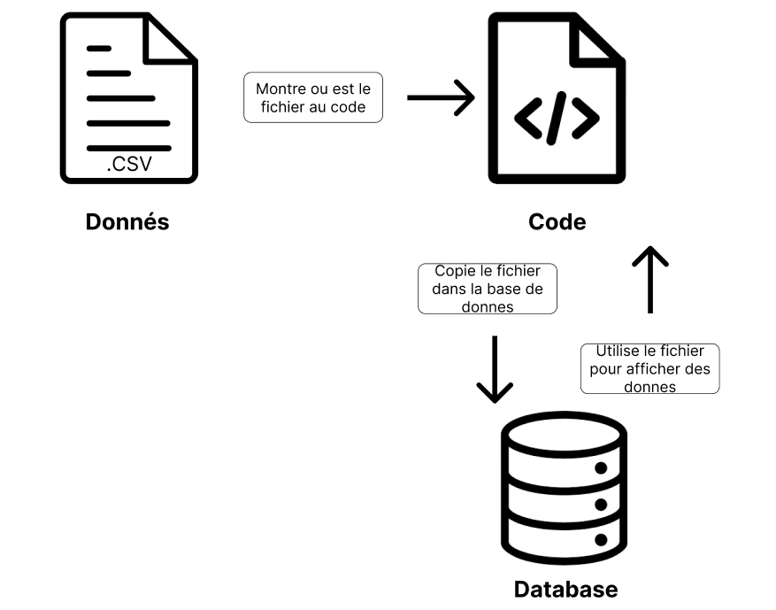

# Rapport *Plot those dots*

**Eleve:** Romain Denis

**Client:** Xavier Carrel

**Dates:** 29.08.2025 - 09.01.2026

## Introduction

### Objectifs du produit et pédagogiques
- Concevoir un logiciel pour afficher des graphiques sur des données

### Description du domaine
- P_Fun: Plot Those Lines
- J'ai décidé de me baser sur les donnés de la NBA
- Mes donnés sont venus de [BasketballReference](https://www.basketball-reference.com/) et ChatGPT
- Mes donnés sont dans */doc/data.csv*

- Limites et périmètre du projet

---

## Planification
- [GitHub Project](https://github.com/users/romaindenis1/projects/5)
- [Issues GitHub] (https://github.com/romaindenis1/plot-those-lines/issues?q=is%3Aissue)
- Les étapes clés du projet
    - Planification
    - Réalisation
    - Rapport
- Organisation du travail (planning, deadlines)

---

## Rapport de tests
- Méthodologie de test adoptée
- Résultats obtenus
- Problèmes rencontrés et corrections apportées

---

## Maquettes

Representation Graphique

Pour cette maquette, on cherche a montrer les parametres d'affichage. On montre que le graphique doit avoire un axe x et y, et que il y a une legende avec la couleur et le nom d'une donné. 

Flexibilité D'affichage

Pour cette maquette, on cherche a montrer que il y a un slider pour zoomer et dezoomer le graphique, et que il y a aussi un affichage de la date et de la valeur d'une donné si la souris et mis sur une donne.

Importation de donnes flexible
 

Pour cette maquette, on cherche a montrer qu'il y a un bouton pour importer.
Dans le schema, on cherche a montrer comment les donnés sont stockés de manières permanentes. Si les donnes sont validés par le programme, le fichier est copié dans le repertoire du programme et ensuite chargé pour etre affiché.

Affichage de Fonctions Mathematiques

Dans cette maquette, on cherche a montrer que en utilisant la boite de texte, on peux entrer une fonction mathematique et la faire apparaitre avec nos autre donnés. Meme si cette fonctionalité n'est pas implémenté dans mon code, je pense que elle est assez claire pour que moi ou un autre developpeur puisse la réaliser dans le futur

## Usage de l’IA dans le projet

- L'AI a seulement été utilisé pour les taches avec aucune valeure ajouté par humain, par example:
    - Le squelette de rapport
    - Donnés
- L'AI a acceleré les taches avec aucune valeur ajouté humain, et la lecture de la documentation (surtout la documentation scottplot qui est compliqué)
- Réflexion critique sur les avantages et limites

---

## Conclusion / Bilan
- Points forts du projet
- Axes d’amélioration possibles
- Compétences acquises
- Perspectives futures

---

